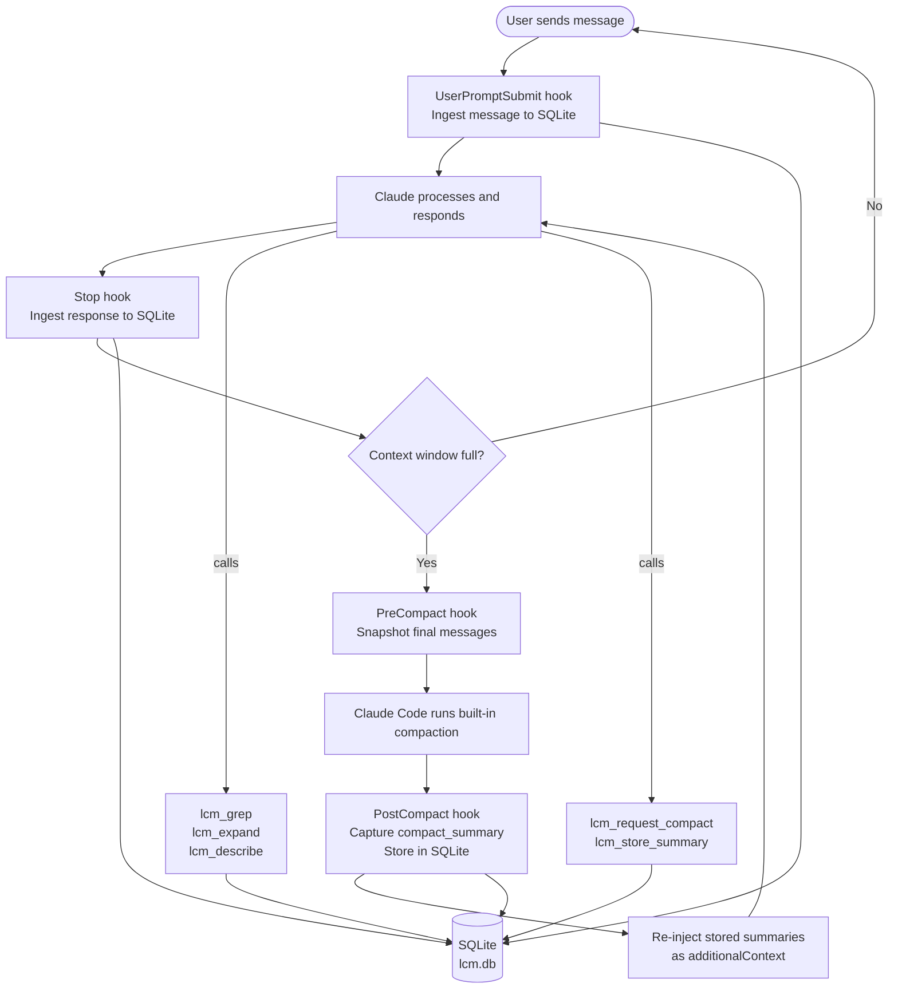

# LCM — Lossless Context Management for Claude Code

A Claude Code plugin that ensures **nothing is ever lost to context compaction**. Every message is persisted to SQLite, Claude's own compaction summaries are captured automatically, and you can search or expand your full conversation history at any time via MCP tools — all without a separate API key.

---

## Quick Start

```bash
/plugin marketplace add isaiahbernados/lcm
/plugin install lcm@isaiahbernados
/reload-plugins
```

No build step, no API key, no manual configuration. Hooks and MCP tools are registered automatically.

---

## The Problem

Claude Code has a finite context window. When it fills up, the built-in `/compact` command (or auto-compaction) condenses the conversation into a single summary and discards the original messages. That summary is good, but it's lossy — specific code snippets, file paths, error messages, and nuanced decisions don't survive.

This is especially painful in long engineering sessions where decisions made in hour one affect code written in hour three.

## How LCM Solves It

LCM layers on top of Claude Code's existing compaction without replacing it. It:

1. **Captures every message** to a local SQLite database via hooks
2. **Intercepts Claude's own compaction** — storing the summary it generates for free
3. **Re-injects stored context** after compaction so Claude always knows what happened
4. **Exposes retrieval tools** so Claude can search and expand its full history on demand



---

## How It Differs from Normal Compaction

| | Claude Code's built-in compaction | LCM |
|---|---|---|
| **What's preserved** | One summary of the whole conversation | Every original message + all past summaries |
| **After compaction** | Earlier messages are gone | All messages remain queryable |
| **Across sessions** | Summary is re-injected at start | All prior sessions searchable |
| **Search** | Not possible | Full-text search via `lcm_grep` |
| **Cost** | Free (uses subscription) | Free (uses subscription, no separate API key) |
| **Storage** | In Claude Code's memory | Local SQLite (`~/.lcm/lcm.db`) |
| **DAG hierarchy** | Flat single summary | Multi-level summaries (compactable over time) |

The key insight: LCM doesn't fight compaction — it captures what Claude generates, then lets Claude retrieve it later. Claude's subscription model does all the work.

---

## References

This plugin is an adaptation of the following work:

- **LCM Paper** — [Lossless Context Management](https://papers.voltropy.com/LCM) — the academic paper describing the hierarchical DAG approach to context management
- **lossless-claw** — [github.com/martian-engineering/lossless-claw](https://github.com/martian-engineering/lossless-claw) — the reference TypeScript implementation for OpenClaw, which this plugin heavily adapts. The key architectural difference: lossless-claw calls an LLM directly (e.g. Haiku via the Anthropic API) to generate its DAG summaries, giving it fine-grained control over chunking and compression. This plugin instead captures the `compact_summary` that Claude Code generates for free using your existing subscription, then lets Claude condense accumulated summaries via MCP tools. The tradeoff: no separate API key or billing, but leaf summaries are coarser (one per compaction cycle rather than one per 20K-token chunk).
- **Claude Code Hooks** — [Claude Code documentation](https://docs.anthropic.com/en/docs/claude-code) — the extension system that makes this plugin possible

---

## Architecture

```
lcm/
├── src/
│   ├── core/               # Storage, retrieval, context assembly
│   │   ├── types.ts
│   │   ├── conversation-store.ts   # SQLite message store + FTS5
│   │   ├── summary-store.ts        # DAG summary storage
│   │   ├── transcript-reader.ts    # Parses Claude Code JSONL transcripts
│   │   ├── retrieval-engine.ts     # grep / describe / expand
│   │   └── context-assembler.ts   # Builds post-compact injection block
│   ├── db/                 # Database connection and migrations
│   ├── hook-handlers/      # One file per Claude Code hook event
│   ├── mcp-server/         # MCP stdio server + tool definitions
│   └── utils/              # Logger
├── hooks/
│   ├── hooks.json          # Hook event registrations
│   └── run-hook.sh         # Shell dispatcher → Node.js
├── skills/
│   └── lcm-usage/SKILL.md  # Teaches Claude when/how to use LCM tools
├── .claude-plugin/
│   └── plugin.json         # Plugin metadata
└── .mcp.json               # MCP server configuration
```

**Hook events used:**

| Hook | Sync | Purpose |
|------|------|---------|
| `SessionStart` | ✓ | Init DB, inject prior session context |
| `UserPromptSubmit` | async | Ingest new user message |
| `Stop` | async | Ingest assistant response + tool results |
| `PreCompact` | ✓ | Final message snapshot before compaction |
| `PostCompact` | ✓ | Capture `compact_summary`, re-inject context |

---

## Installation

### Prerequisites

- [Claude Code](https://claude.ai/code) CLI installed
- Node.js 22+ (uses built-in `node:sqlite` — no native modules required)

### Install via Claude Code plugin system (recommended)

```bash
# 1. Add this repo as a marketplace source
/plugin marketplace add isaiahbernados/lcm

# 2. Install the plugin
/plugin install lcm@isaiahbernados

# 3. Reload plugins in your current session
/reload-plugins
```

That's it. Hooks and the MCP server are registered automatically. The plugin ships with pre-built JS — no build step required.

### Manual install

If you prefer to install manually or use a development checkout:

```bash
git clone https://github.com/isaiahbernados/lcm ~/lcm
```

Then add to `~/.claude/settings.json`:

```json
{
  "hooks": {
    "SessionStart": [
      { "matcher": "", "hooks": [{ "type": "command", "command": "~/lcm/hooks/run-hook.sh session-start" }] }
    ],
    "UserPromptSubmit": [
      { "matcher": "", "hooks": [{ "type": "command", "command": "~/lcm/hooks/run-hook.sh user-prompt-submit" }] }
    ],
    "Stop": [
      { "matcher": "", "hooks": [{ "type": "command", "command": "~/lcm/hooks/run-hook.sh stop" }] }
    ],
    "PreCompact": [
      { "matcher": "", "hooks": [{ "type": "command", "command": "~/lcm/hooks/run-hook.sh pre-compact", "timeout": 60 }] }
    ],
    "PostCompact": [
      { "matcher": "", "hooks": [{ "type": "command", "command": "~/lcm/hooks/run-hook.sh post-compact" }] }
    ]
  },
  "mcpServers": {
    "lcm": {
      "command": "node",
      "args": ["~/lcm/dist/mcp-server/index.js"]
    }
  }
}
```

### Verify

Start a Claude Code session. You should see the LCM MCP tools available:

```
lcm_grep, lcm_describe, lcm_expand, lcm_expand_query,
lcm_request_compact, lcm_store_summary
```

---

## Usage

### Automatic (no action required)

LCM works silently in the background. Every message is captured to SQLite (`~/.claude/plugins/data/lcm/lcm.db` when installed via `/plugin install`, or `~/.lcm/lcm.db` for manual installs). When compaction happens, the summary Claude generates is stored and re-injected automatically.

### Retrieving history

After compaction, ask Claude to search for something it may have forgotten:

```
Search LCM for the authentication approach we discussed earlier.
```

Or directly invoke the tools:

```
lcm_grep(query: "database schema migration")
lcm_expand_query(query: "the error we fixed in the login flow")
```

### Proactive condensation

When you have many stored summaries and want to compress them into a higher-level summary (free — Claude does it):

```
Please compact our LCM history using lcm_request_compact then lcm_store_summary.
```

Claude will:
1. Call `lcm_request_compact` to get the accumulated summaries
2. Condense them into a tighter summary
3. Call `lcm_store_summary` to persist it

### Configuration

All settings via environment variables:

| Variable | Default | Description |
|----------|---------|-------------|
| `LCM_DB_PATH` | `~/.lcm/lcm.db` | SQLite database path |
| `LCM_FRESH_TAIL_COUNT` | `32` | Recent messages protected from compaction |
| `LCM_POST_COMPACT_TOKENS` | `3000` | Max tokens injected after compaction |
| `LCM_ENABLED` | `true` | Set to `false` to disable |
| `LCM_LOG_FILE` | `~/.lcm/lcm.log` | Log file path |
| `LCM_DEBUG` | _(unset)_ | Set to any value to enable debug logging |
| `LCM_ANTHROPIC_API_KEY` | _(unset)_ | Anthropic API key for granular compaction. If set (falls back to `ANTHROPIC_API_KEY`), summarizes every ~20K tokens using Haiku — same approach as lossless-claw. Without this, summaries are only created on compaction. |
| `LCM_GRANULAR_THRESHOLD` | `20000` | Token threshold for triggering a granular summary (requires `LCM_ANTHROPIC_API_KEY`). |

---

## No API Key Required

LCM uses **no external API calls**. All summarization is performed by Claude Code using your existing subscription:

- **Leaf summaries** — captured from Claude Code's own `compact_summary` output (generated for free during compaction)
- **DAG condensation** — done by Claude itself via `lcm_request_compact` + `lcm_store_summary` MCP tools

The only dependencies are `@modelcontextprotocol/sdk` and Node.js's built-in `node:sqlite`.
