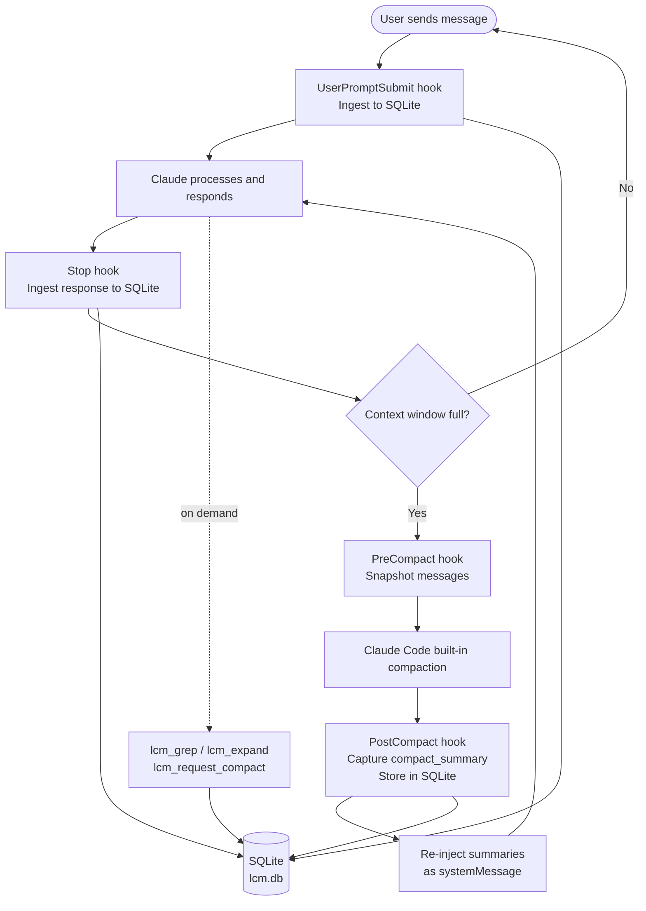

# LCM — Lossless Context Management for Claude Code

A Claude Code plugin that ensures **nothing is ever lost to context compaction**. Every message is persisted to SQLite, compaction summaries are captured and re-injected automatically, and Claude can search its full conversation history on demand via MCP tools.

---

## Quick Start

```bash
/plugin marketplace add isaiahbernados/lcm
/plugin install lcm@isaiahbernados
/reload-plugins
```

No build step, no manual configuration. Hooks and MCP tools are registered automatically.

**Optional — granular compaction** (summarize every ~20K tokens, not just at compaction):

```bash
# Free — uses your Claude subscription via claude -p (~5-6s/call):
export LCM_USE_CLI=true

# Faster — direct Haiku API (~1s/call, ~$0.001/call):
export ANTHROPIC_API_KEY=sk-ant-api03-...
```

Without either, summaries are still created automatically on each compaction cycle.

---

## The Problem

Claude Code has a finite context window. When it fills up, the built-in `/compact` command (or auto-compaction) condenses the conversation into a single summary and discards the original messages. That summary is good, but it's lossy — specific code snippets, file paths, error messages, and nuanced decisions don't survive.

This is especially painful in long engineering sessions where decisions made in hour one affect code written in hour three.

## How LCM Solves It

LCM layers on top of Claude Code's existing compaction without replacing it. It:

1. **Captures every message** to a local SQLite database via hooks
2. **Intercepts Claude's own compaction** — storing the summary it generates for free
3. **Re-injects stored context** after compaction so Claude always knows what happened
4. **Exposes retrieval tools** so Claude can search and expand its full history on demand



> **Granular mode** (`LCM_USE_CLI=true` or `ANTHROPIC_API_KEY`): the Stop hook also checks the accumulated token count since the last summary and, if over the threshold, calls Haiku to generate a fine-grained summary — so history is preserved at higher resolution even within a single compaction cycle. See [Summarization Modes](#summarization-modes) below.

---

## How It Differs from Normal Compaction

| | Claude Code's built-in compaction | LCM |
|---|---|---|
| **What's preserved** | One summary of the whole conversation | Every original message + all past summaries |
| **After compaction** | Earlier messages are gone | All messages remain queryable |
| **Across sessions** | Summary is re-injected at start | All prior sessions searchable |
| **Search** | Not possible | Full-text search via `lcm_grep` |
| **Cost** | Free (uses subscription) | Free by default; optional granular mode via CLI (free) or SDK (~$0.001/call) |
| **Storage** | In Claude Code's memory | Local SQLite (`~/.lcm/lcm.db`) |
| **Summary storage** | Discarded after session | Persisted in SQLite, all sessions searchable |
| **Manual condensation** | Not possible | `lcm_request_compact` + `lcm_store_summary` condenses summaries on demand |

The key insight: LCM doesn't fight compaction — it captures what Claude generates, then lets Claude retrieve it later.

---

## Summarization Modes

LCM supports three modes, selectable via environment variables:

### Default — compaction-cycle summaries (free)

No configuration needed. When Claude Code's built-in compaction fires, LCM captures the `compact_summary` it generates and stores it in SQLite. This summary is then re-injected as `additionalContext` after compaction so Claude resumes with full awareness of what was discussed.

**Granularity:** one summary per compaction cycle (coarser, but completely free).

### CLI mode — granular via `claude -p` (free)

```bash
export LCM_USE_CLI=true
```

The Stop hook spawns `claude -p --model claude-haiku-4-5-20251001` as a subprocess after each response. When accumulated tokens since the last summary exceed `LCM_GRANULAR_THRESHOLD` (default 20 000), Haiku summarizes that message batch and stores it in SQLite.

**Granularity:** one summary per ~20K tokens. **Cost:** free (uses your Claude Code subscription). **Overhead:** ~5-6s per summarization call.

### SDK mode — granular via Anthropic API (faster)

```bash
export ANTHROPIC_API_KEY=sk-ant-api03-...
# or: export LCM_ANTHROPIC_API_KEY=sk-ant-api03-...
```

Same threshold logic as CLI mode, but calls Haiku directly via `@anthropic-ai/sdk` — no subprocess startup cost.

**Granularity:** one summary per ~20K tokens. **Cost:** ~$0.001/call. **Overhead:** ~1s per call. If both `ANTHROPIC_API_KEY` and `LCM_USE_CLI` are set, the SDK takes priority.

### Future: MCP Sampling

> The ideal implementation of granular compaction would use [MCP Sampling](https://modelcontextprotocol.io/docs/concepts/sampling) — a protocol feature that lets MCP servers request LLM completions through the host application rather than calling the API directly. This would give LCM fine-grained summarization using the user's existing subscription with no subprocess overhead and no API key required. MCP sampling is not yet available in Claude Code; when it ships, it will replace both the `LCM_USE_CLI` and SDK modes.

---

## References

This plugin is an adaptation of the following work:

- **LCM Paper** — [Lossless Context Management](https://papers.voltropy.com/LCM) — the academic paper describing the hierarchical DAG approach to context management
- **lossless-claw** — [github.com/martian-engineering/lossless-claw](https://github.com/martian-engineering/lossless-claw) — the reference TypeScript implementation for OpenClaw, which this plugin heavily adapts. lossless-claw calls an LLM directly (Haiku via the Anthropic API) to generate its DAG summaries at ~20K-token granularity. This plugin offers the same granularity via two optional modes (CLI subprocess or SDK), but defaults to capturing Claude Code's own `compact_summary` for free — no API key required. The tradeoff: coarser leaf summaries by default (one per compaction cycle), finer when a key or `LCM_USE_CLI` is configured.
- **Claude Code Hooks** — [Claude Code documentation](https://docs.anthropic.com/en/docs/claude-code) — the extension system that makes this plugin possible

---

## Architecture

```
lcm/
├── src/
│   ├── core/               # Storage, retrieval, context assembly
│   │   ├── types.ts
│   │   ├── conversation-store.ts   # SQLite message store + FTS5
│   │   ├── summary-store.ts        # DAG summary storage
│   │   ├── transcript-reader.ts    # Parses Claude Code JSONL transcripts
│   │   ├── retrieval-engine.ts     # grep / describe / expand
│   │   ├── context-assembler.ts    # Builds post-compact injection block
│   │   ├── summarize.ts            # Haiku summarization via Anthropic SDK
│   │   └── summarize-cli.ts        # Haiku summarization via claude -p subprocess
│   ├── db/                 # Database connection and migrations
│   ├── hook-handlers/      # One file per Claude Code hook event
│   ├── mcp-server/         # MCP stdio server + tool definitions
│   └── utils/              # Logger
├── hooks/
│   ├── hooks.json          # Hook event registrations
│   └── run-hook.sh         # Shell dispatcher → Node.js
├── skills/
│   └── lcm-usage/SKILL.md  # Teaches Claude when/how to use LCM tools
├── .claude-plugin/
│   └── plugin.json         # Plugin metadata
└── .mcp.json               # MCP server configuration
```

**Hook events used:**

| Hook | Sync | Purpose |
|------|------|---------|
| `SessionStart` | ✓ | Init DB, inject prior session context |
| `UserPromptSubmit` | async | Ingest new user message |
| `Stop` | async | Ingest assistant response; optionally trigger granular summary |
| `PreCompact` | ✓ | Final message snapshot before compaction |
| `PostCompact` | ✓ | Capture `compact_summary`, re-inject context |

---

## Installation

### Prerequisites

- [Claude Code](https://claude.ai/code) CLI installed
- Node.js 22+ (uses built-in `node:sqlite` — no native modules required)

### Install via Claude Code plugin system (recommended)

```bash
# 1. Add this repo as a marketplace source
/plugin marketplace add isaiahbernados/lcm

# 2. Install the plugin
/plugin install lcm@isaiahbernados

# 3. Reload plugins in your current session
/reload-plugins
```

That's it. Hooks and the MCP server are registered automatically. The plugin ships with pre-built JS — no build step required.

### Manual install

If you prefer to install manually or use a development checkout:

```bash
git clone https://github.com/isaiahbernados/lcm ~/lcm
```

Then add to `~/.claude/settings.json`:

```json
{
  "hooks": {
    "SessionStart": [
      { "matcher": "", "hooks": [{ "type": "command", "command": "~/lcm/hooks/run-hook.sh session-start" }] }
    ],
    "UserPromptSubmit": [
      { "matcher": "", "hooks": [{ "type": "command", "command": "~/lcm/hooks/run-hook.sh user-prompt-submit" }] }
    ],
    "Stop": [
      { "matcher": "", "hooks": [{ "type": "command", "command": "~/lcm/hooks/run-hook.sh stop" }] }
    ],
    "PreCompact": [
      { "matcher": "", "hooks": [{ "type": "command", "command": "~/lcm/hooks/run-hook.sh pre-compact", "timeout": 60 }] }
    ],
    "PostCompact": [
      { "matcher": "", "hooks": [{ "type": "command", "command": "~/lcm/hooks/run-hook.sh post-compact" }] }
    ]
  },
  "mcpServers": {
    "lcm": {
      "command": "node",
      "args": ["~/lcm/dist/mcp-server/index.js"]
    }
  }
}
```

### Verify

Start a Claude Code session. You should see the LCM MCP tools available:

```
lcm_grep, lcm_describe, lcm_expand, lcm_expand_query,
lcm_request_compact, lcm_store_summary
```

---

## Usage

### Automatic (no action required)

LCM works silently in the background. Every message is captured to SQLite (`~/.claude/plugins/data/lcm/lcm.db` when installed via `/plugin install`, or `~/.lcm/lcm.db` for manual installs). When compaction happens, the summary Claude generates is stored and re-injected automatically.

### Retrieving history

After compaction, ask Claude to search for something it may have forgotten:

```
Search LCM for the authentication approach we discussed earlier.
```

Or directly invoke the tools:

```
lcm_grep(query: "database schema migration")
lcm_expand_query(query: "the error we fixed in the login flow")
```

### Proactive condensation

When you have many stored summaries and want to compress them into a higher-level summary (free — Claude does it):

```
Please compact our LCM history using lcm_request_compact then lcm_store_summary.
```

Claude will:
1. Call `lcm_request_compact` to get the accumulated summaries
2. Condense them into a tighter summary
3. Call `lcm_store_summary` to persist it

### Configuration

All settings via environment variables:

| Variable | Default | Description |
|----------|---------|-------------|
| `LCM_DB_PATH` | `~/.lcm/lcm.db` | SQLite database path |
| `LCM_FRESH_TAIL_COUNT` | `32` | Recent messages protected from compaction |
| `LCM_POST_COMPACT_TOKENS` | `3000` | Max tokens injected after compaction |
| `LCM_ENABLED` | `true` | Set to `false` to disable |
| `LCM_LOG_FILE` | `~/.lcm/lcm.log` | Log file path |
| `LCM_DEBUG` | _(unset)_ | Set to any value to enable debug logging |
| `LCM_USE_CLI` | `false` | Enable granular compaction via `claude -p` subprocess (free, ~5-6s/call) |
| `LCM_CLI_MODEL` | `claude-haiku-4-5-20251001` | Model used for CLI-based summarization |
| `LCM_ANTHROPIC_API_KEY` | _(unset)_ | Anthropic API key for SDK-based granular compaction (~1s/call). Falls back to `ANTHROPIC_API_KEY`. Takes priority over `LCM_USE_CLI`. |
| `LCM_GRANULAR_THRESHOLD` | `20000` | Token threshold for triggering a granular summary (requires `LCM_USE_CLI` or `LCM_ANTHROPIC_API_KEY`) |
